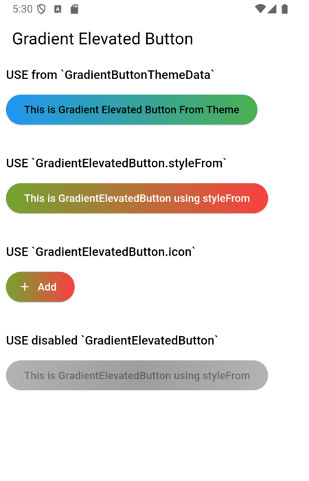

# GradientElevatedButton

[](https://pub.dartlang.org/packages/gradient_elevated_button)
[](https://github.com/ChegzDev/gradient_elevated_button/blob/master/LICENSE) 


A customizable elevated button with gradient support for your Flutter applications. This package allows you to create buttons with gradient backgrounds, custom foreground colors, and various other customizable properties using the `GradientElevatedButton` widget.

## Features

- **Gradient Background:** Easily apply gradients to your button backgrounds.
- **Customizable Style:** Customize text color, shape, padding, and more.
- **Integration with Theme:** Use `GradientButtonThemeData` to apply a consistent style across your app.


[Demo]




## Usage

### 1. Using GradientButtonThemeData

The `GradientButtonThemeData` allows you to define a consistent button style across your app. Here's how to use it:

```dart
    main() {
      return GradientButtonThemeData(
        data: GradientElevatedButton.styleFrom(
          gradient: const LinearGradient(
            colors: [Colors.blue, Colors.green],
            begin: Alignment.centerLeft,
            end: Alignment.centerRight,
          ),
          foregroundColor: Colors.black,
        ),
        child: const MaterialApp(
          // Your app code
        ),
      );
    }
```
### 2. Using GradientElevatedButton with Theme

Once you've defined the theme, you can directly use `GradientElevatedButton` with the inherited gradient feature from `GradientButtonThemeData`.

```dart
    Widget gradientButton = GradientElevatedButton(
      onPressed: () {},
      child: const Text("This is Gradient Elevated Button From Theme"),
    );
```
### 3. Using GradientElevatedButton.styleFrom

Alternatively, you can style the `GradientElevatedButton` directly using `GradientElevatedButton.styleFrom` to define the button's gradient, shape, and other properties:

```dart

Widget gradientWidget = GradientElevatedButton(
  onPressed: () {

  },
  style: GradientElevatedButton.styleFrom(
    gradient: const LinearGradient(colors: [
      Color.fromARGB(255, 166, 206, 57),
      Color.fromARGB(255, 0, 175, 173),
    ],
      disabledGradient: const LinearGradient(colors: [
        Colors.grey.withAlpha(200),
        Colors.grey,
        Colors.grey.withAlpha(200),
      ],
        begin: Alignment.topCenter,
        end: Alignment.bottomCenter,
      ),
    ),
  ),
  child: const Text("This is Gradient Elevated Button"),
);
```  

## Customization
You can fully customize the GradientElevatedButton using the following properties:

- **backgroundGradient**: A `LinearGradient` (or other types) that defines the background gradient.
- **foregroundColor**: The color of the text and icon on the button.
- **disabledBackgroundGradient**: A `LinearGradient` (or other types) that defines the disabled background gradient.
- **disabledForegroundColor**: The color of the text and icon on the disabled button.
- **padding**: Padding inside the button.
- **shape**: Define the button’s shape with a `ShapeBorder` like `RoundedRectangleBorder` or `StadiumBorder`.
- **elevation**: Controls the button's elevation (default: 2).
- **onPressed**: The callback function that is called when the button is pressed.

## Example

[click here] for example


## Issues and Feedback

Please file any issues or provide feedback by visiting the [Issues and Feedback] for this repository.

For suggestions or further feedback, feel free to send an email to __chegz.dev@gmail.com__, and we'd be happy to hear from you!

[Issues and Feedback] : (https://github.com/ChegzDev/gradient_elevated_button/issues/new)
[click here](https://github.com/ChegzDev/gradient_elevated_button/blob/master/example/lib/main.dart)
[Demo](https://github.com/ChegzDev/gradient_elevated_button/blob/master/example/lib/main.dart)
